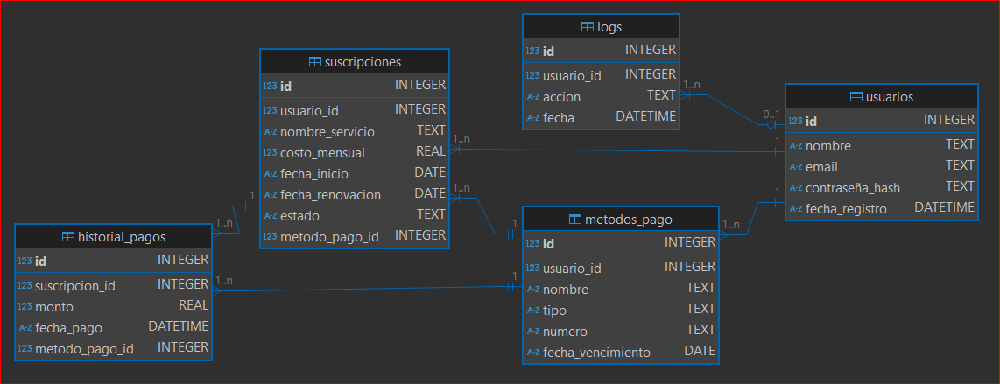

# 💵 BillGuard

Bienvenido a **BillGuard**, una aplicación para gestionar tus suscripciones (Netflix, Spotify ...) para ayudarte a gestionar tu cartera y  tener en un mismo sitio donde te estas gastando al mes en servicios de suscripción. Esta guía te ayudará a entender cómo funciona la aplicación y cómo está estructurada la base de datos.

### 📚 Índice

1. 🌟 [Introducción](./#introduccion)
2. 🗺️ [Diagrama E-R](./#diagrama-e-r)
3. 📋 [Descripción de Tablas](./#descripcion-de-tablas)

### 🌟 Introducción

**BillGuard** es una aplicación desarrollada en Python utilizando PyQt6 para la interfaz gráfica y SQLite para la base de datos, a parte de Firebase para la autentificación de usuarios. La aplicación permite a los usuarios gestionar sus suscripciones de manera eficiente.

### 🗺️ Diagrama E-R

A continuación se muestra el diagrama E-R de la base de datos utilizada en **BillGuard**:

<figure><figcaption></figcaption></figure>

### 📋 Descripción de Tablas

#### Usuarios

| Campo            | Tipo     | Clave | Descripción              |
| ---------------- | -------- | ----- | ------------------------ |
| id               | INTEGER  | PK    | Identificador de usuario |
| nombre           | TEXT     |       | Nombre del usuario       |
| email            | TEXT     | ÚNICO | Correo electrónico       |
| contraseña\_hash | TEXT     |       | Contraseña cifrada       |
| fecha\_registro  | DATETIME |       | Fecha de registro        |

***

#### Suscripciones

| Campo             | Tipo    | Clave | Descripción                  |
| ----------------- | ------- | ----- | ---------------------------- |
| id                | INTEGER | PK    | Identificador de suscripción |
| usuario\_id       | INTEGER | FK    | Usuario propietario          |
| nombre\_servicio  | TEXT    |       | Nombre del servicio          |
| costo\_mensual    | REAL    |       | Precio mensual               |
| fecha\_inicio     | DATE    |       | Fecha de inicio              |
| fecha\_renovacion | DATE    |       | Próxima renovación           |
| estado            | TEXT    |       | Estado (Activo/Pausado)      |
| metodo\_pago\_id  | INTEGER | FK    | Método de pago asociado      |

***

#### Metodos de pago

| Campo              | Tipo    | Clave | Descripción                      |
| ------------------ | ------- | ----- | -------------------------------- |
| id                 | INTEGER | PK    | Identificador del método de pago |
| usuario\_id        | INTEGER | FK    | Usuario propietario              |
| nombre             | TEXT    |       | Nombre del método (ej: Visa)     |
| tipo               | TEXT    |       | Tipo (Tarjeta, PayPal, etc.)     |
| numero             | TEXT    |       | Número (enmascarado)             |
| fecha\_vencimiento | TEXT    |       | Fecha de vencimiento             |

***

#### Historial de pagos

| Campo            | Tipo    | Clave | Descripción            |
| ---------------- | ------- | ----- | ---------------------- |
| id               | INTEGER | PK    | Identificador del pago |
| suscripcion\_id  | INTEGER | FK    | Suscripción asociada   |
| monto            | REAL    |       | Monto pagado           |
| fecha\_pago      | DATE    |       | Fecha del pago         |
| metodo\_pago\_id | INTEGER | FK    | Método de pago usado   |

***

#### Logs

| Campo       | Tipo     | Clave | Descripción                   |
| ----------- | -------- | ----- | ----------------------------- |
| id          | INTEGER  | PK    | Identificador del log         |
| usuario\_id | INTEGER  | FK    | Usuario que realizó la acción |
| accion      | TEXT     |       | Descripción de la acción      |
| fecha       | DATETIME |       | Fecha y hora del evento       |

\
